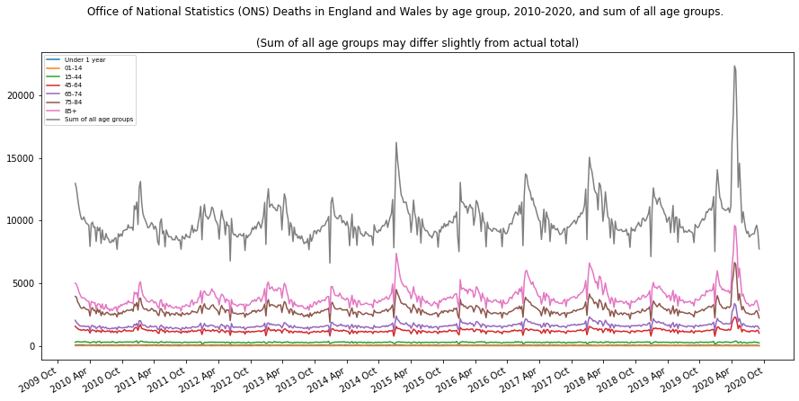

# ons_deaths_data

Some processing and graphing scripts for [Office of National Statistics Deaths data](https://www.ons.gov.uk/peoplepopulationandcommunity/birthsdeathsandmarriages/deaths/datasets/weeklyprovisionalfiguresondeathsregisteredinenglandandwales) data.

This data covers England, Wales and Northern Ireland.

The code extracts the relevant data from the spreadsheets that have been downloaded from the above ONS site. For the year 2020 we homogenise the age groups to match that used in the previous years.

The ONS release data every deaths data every 2 weeks, so you need to download the latest spreadsheet and save it into ons_data_files.

The data is collated into one large dataframe and I create a sum column for all age ranges.
(This may differ from the official published deaths as some deaths may be missing from the agre group data if the age was not known etc.)



To use, type:
```python
python ons_deaths.py
```
